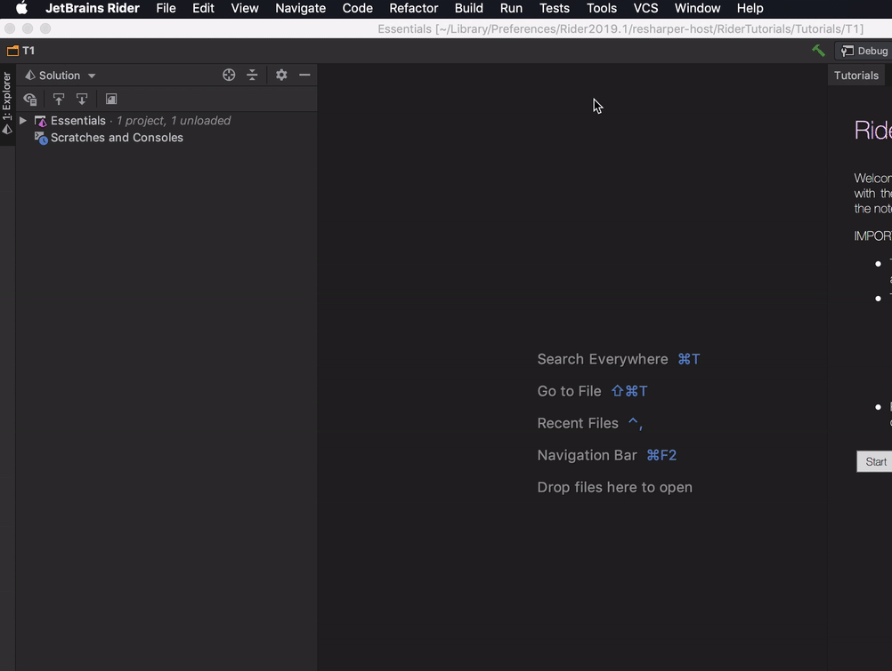

# JetBrains: Open project

**Alfred5** workflow to easily open your projects with your favorite JetBrains product.


[](https://sonarcloud.io/dashboard?id=bchatard_alfred-jetbrains)

## Requirements

You need [Node.js LTS](https://nodejs.org) and [Alfred 5.5+](https://www.alfredapp.com) with the paid [Powerpack](https://www.alfredapp.com/powerpack/) upgrade.

This workflow need one of JetBrains products (**2019.1+**), and its [shell script](#init-shell-script) to works

## About issues

It's my daily tool, so I will fix issue that I can reproduce with **my environment**, which is
* macOS 14.0
* Alfred 5.5 (latest available)
* at least Node 18, but not really important, node is only required to install this workflow

Please check the [troubleshooting guide](doc/troubleshooting.md) first, and other issues.
And please follow the issue template for bug report 🙏

## Installation / Update

```shell
$ npm install -g @bchatard/alfred-jetbrains
```

### Init shell script

- Via JetBrains Toolbox:
  - Open the JetBrains Toolbox window, and then click on the parameter icon;
  - In the following form, enable _Generate shell scripts_, and set a path for script
  - More info: [Toolbox App 1.11: What’s New.](https://blog.jetbrains.com/blog/2018/08/23/toolbox-app-1-11-whats-new/)
- Via Product (removed since 2023.x)
  

## How to use

- Open Alfred with your usual hotkey
- Type keyword (example `pstorm`) followed by your project name
  

<details>
<summary>Default Keywords</summary>

- Cross Products: `jb` (search projects on for all products)

- AndroidStudio: `studio`;
- AppCode: `appcode` (sunset by JetBrains, no more support on my side too);
- Aqua: `aqua`;
- CLion/CLion Nova: `clion` (default to "Standard", see [customisation to change this](#customisation));
- DataGrip: `datagrip`;
- DataSpell: `dataspell`;
- Fleet: `fleet`;
- GoLand: `goland`;
- IntelliJ Idea: `idea` (default to Community Edition, see [customisation to change this](#customisation));
- PhpStorm: `pstorm`;
- PyCharm: `pycharm` (default to Community Edition, see [customisation to change this](#customisation));
- Rider: `rider`;
- RubyMine: `rubymine`;
- RustRover: `rustrover`;
- WebStorm: `wstorm`;
- Writerside: `writerside`;

</details>

<details>
<summary>Supported versions</summary>
I test with these products/versions:

- AndroidStudio: since 3.+;
- AppCode: since 2018.3;
- Aqua: since 2023.1;
- CLion: since 2018.3;
- CLion Nova: since 2023.3;
- DataGrip: since 2018.3;
- DataSpell: since 2023.1;
- Fleet: public preview;
- GoLand: since 2018.3;
- IntelliJ Idea: since 2018.3;
- PhpStorm: since 2018.3;
- PyCharm: since 2018.3;
- Rider: since 2018.3;
- RubyMine: since 2018.3;
- RustRover: since 2023.2;
- WebStorm: since 2018.3;
- Writerside: since 2023.2;

</details>

## Customisation

- [Change Product Edition](doc/customisation/edition.md)
- [Change `bin` name](doc/customisation/bin.md)

Some of JetBrains product are available in different editions (ex: PyCharm - Professional, Edu & Community).
In that case they share the same `bin` / `keyword`, so you need to customise the _Preferences_ folder to retrieve your projects.


## Changelog

[Changelog](https://github.com/bchatard/alfred-jetbrains/releases)

## License

[MIT](LICENSE) © [bchatard](https://github.com/bchatard)
