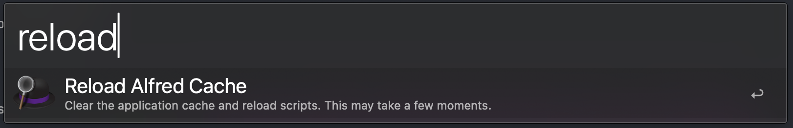
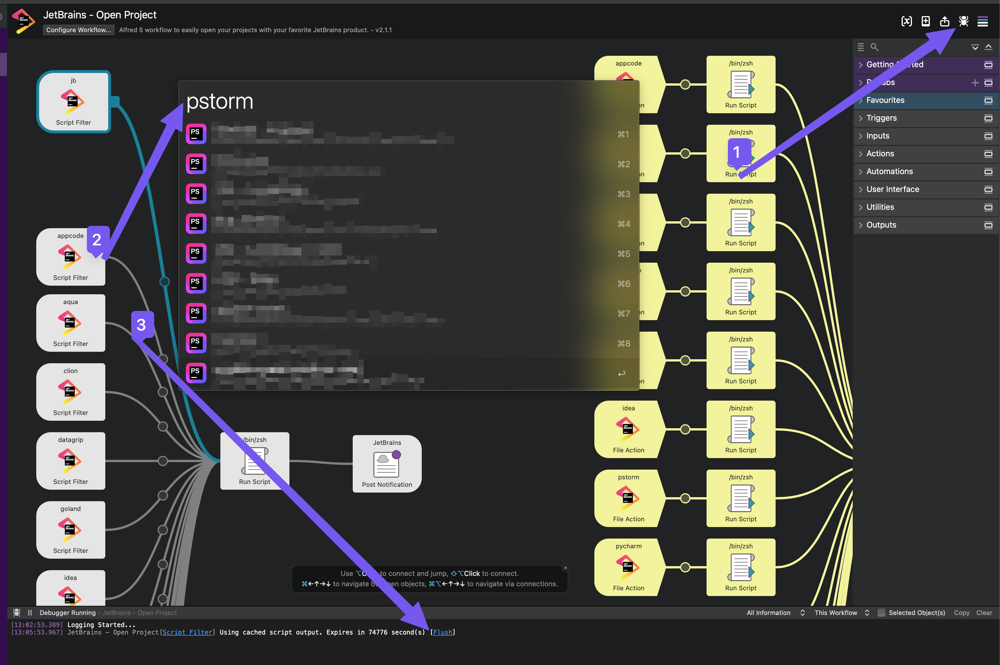

# Troubleshooting

I hope no regular issue will occur with this new version :)

But feel free to open issue

## Cache

This workflow use Alfred cache mechanism: https://www.alfredapp.com/help/workflows/inputs/script-filter/json/#cache.

The TTL is 8600s

You can flush all caches with `reload` command from Alfred

You can clean the cache with the following steps:

